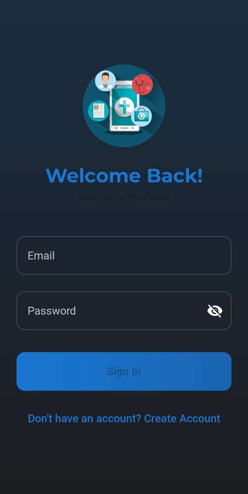
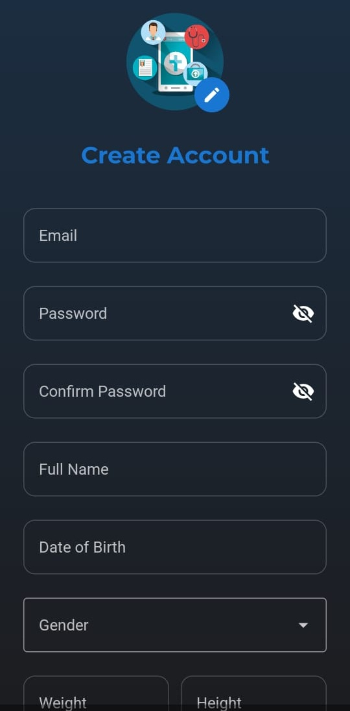
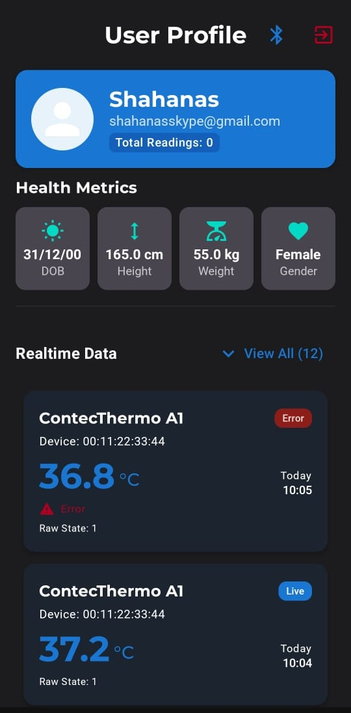
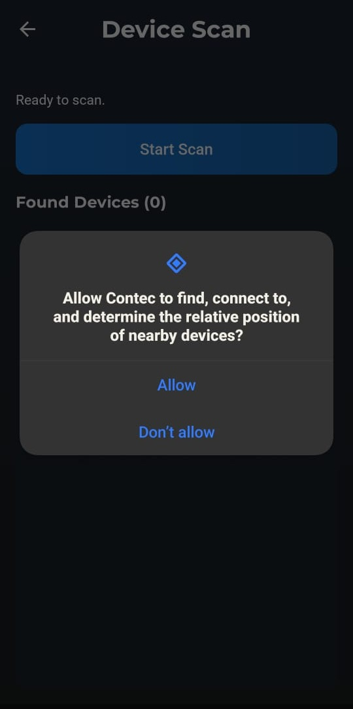
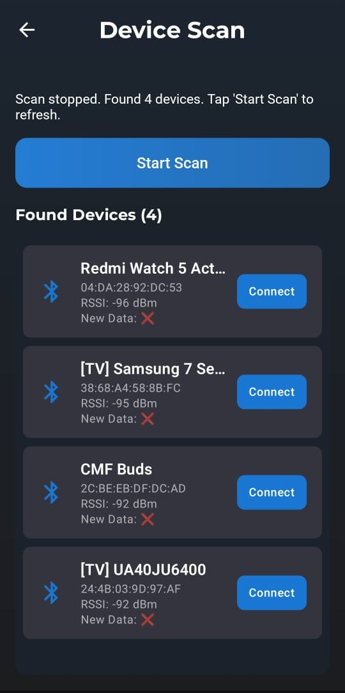

Functional Flow:
Main Screen -> Sign up screen -> On successful sign up -> Navigates to login screen to login the user -> On successful Login -> Moves to profile screen 

On Profile Screen :
Top Bluetooth button -> Navigates to Scan Screen
Top Red Logout button -> Logouts the user -> Navigates to Login Screen

Profile Screen Contains:
1:Basic patient data: name, email, date of birth, gender, weight and height
2:Display area for Real time readings
3:Display area for history data readings

Scan Screen:
1:On starting scan -> search for Bluetooth devices
2:Lists the found Bluetooth devices.
3:On Clicking connect button : Attempts connection to the device
4:Connection status and similar messages displayed on top text.

## Screenshots

  
  
  

  
  
  

Splash Screen:

Login Screen:

Sign Up Screen:

Profile Screen:

Permission:

Scanning Screen:

